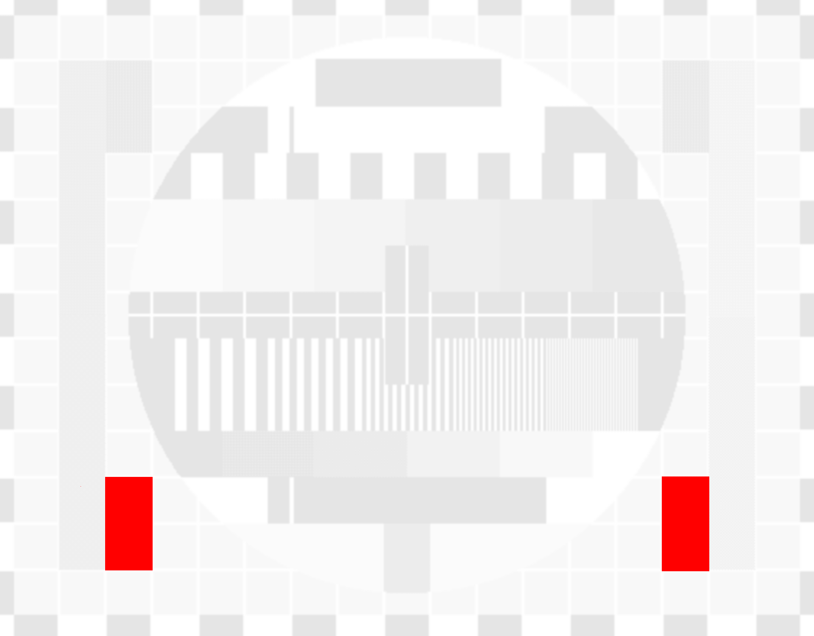
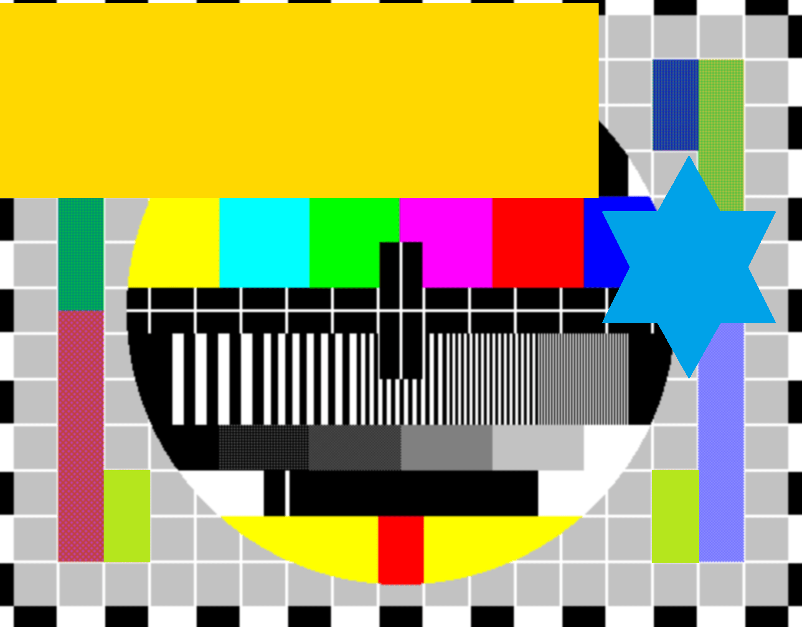
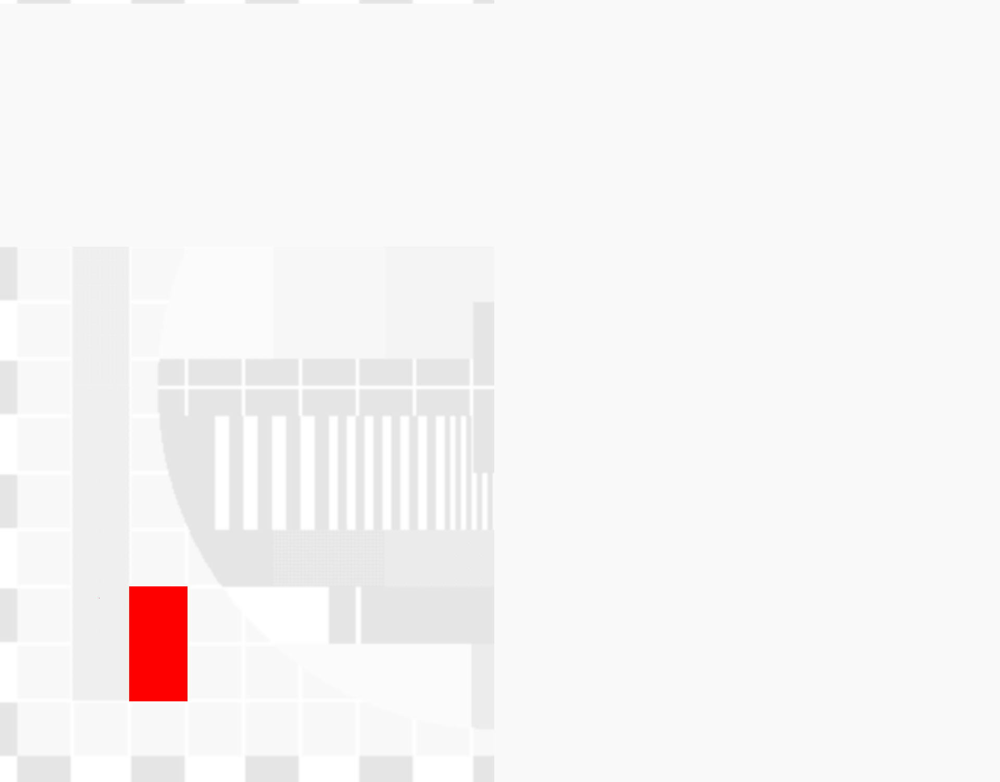

# ImageDiff
## Purpose
ImageDiff determines the differences between two images.

| First input image  | Second input image | Detected differences |
| ------------- | ------------- |------------- |
|   |   |  |

You can tell it to ignore certain areas in the images. 
Choose some random color, cover up those areas in either of the 
images and supply the RGBA values of the selected color. 

| First input image  | Second input image | Detected differences |
| ------------- | ------------- |------------- |
|   |  |   |

## Example
```csharp
using Adrichem.ImageDiff;
using Adrichem.ImageDiff.Algorithms;

var Image1 = SKBitmap.Decode("image1.png");
var Image2 = SKBitmap.Decode("image2.png");

var Differ = new SimpleDiffer
{
    Options = new DiffOptions
    {
        IgnoreColor = new SKColor(255, 216, 0, 255),
    }
};

//OR

var Differ = new PerceptualDiffer
{
    Options = new PerceptualDiffOptions
    {
        IgnoreColor = new SKColor(255, 216, 0, 255),
        Threshold = 0.1f
    }
};
var DiffOutcome = Differ.Diff(Image1, Image2);
var ActualDiffImage = DiffOutcome.DiffImage;

SKImage
    .FromBitmap(ActualDiffImage)
    .Encode()
    .SaveTo("diff-result.png")))
;
```
